# Complete System Topology & Architecture Map

An exhaustive architectural map of the **Gemini Unleashed** cognitive multi-agent organism, detailing all **14 Cloud Run MCP microservices**, external memory databases, supervisory loops, security boundaries, and communication topologies.

---

## 1. High-Level System Architecture Diagram

```mermaid
graph TD
    subgraph Human & Identity Layer [Authority Level 0 & Identity]
        OP["Human Operator (Phillip / Schafertech89@gmail.com)"]
        GWS["Google Workspace Super-Admin (Dev@mindbyte.net)"]
        GH_ACC["GitHub User (mindbyteautomations)"]
    end

    subgraph Cognitive Process Layer [Cognition & Actuation]
        GC["Gemini Core / Gemini Spark (Reasoning & Synthesis)"]
        AO["Antigravity Orchestrator (Interactive Systems & Testing)"]
        JW["Jules Worker (Asynchronous PRs & Issues)"]
        CK["Cognitive Kernel (OWAI Loop)"]
    end

    subgraph Supervisory & Governance Layer [Supervision & Policy]
        HS["Deterministic Heartbeat Supervisor (30-Min Pulse)"]
        BG["Budget Guardian ($130 Monthly Envelope, <$30 Target)"]
        SG["Security Guardian (Constitutional Firewall)"]
        ED["Daily Executive Digest (7:00 AM EDT)"]
    end

    subgraph Epistemic Substrates [Knowledge & Calibration]
        BR["Belief Registry (Active/Stale/Contradicted Claims)"]
        CE["Contradiction Engine (Epistemic Immune System)"]
        CQ["Curiosity Engine (Information Gain / Cost Ranked Unknowns)"]
        CG["Capability Graph (Prerequisite DAG)"]
    end

    subgraph Cloud Run MCP Microservices [14 Managed Microservices]
        M1["gemini-spark-state-mcp (State & Temporal Cortex)"]
        M2["gemini-spark-workspace-admin-mcp (Workspace & Gmail API)"]
        M3["gemini-spark-redis-memory-mcp (Vector Memory)"]
        M4["gemini-spark-github-mcp (GitHub Repos & PRs)"]
        M5["gemini-spark-gsuite-mcp (Drive/Docs/Sheets/Calendar)"]
        M6["gemini-spark-stitch-mcp (Visual Screen Generation)"]
        M7["gemini-spark-nvidia-nim-mcp (Model Benchmarks)"]
        M8["gemini-spark-context7-mcp (Documentation Hub)"]
        M9["gemini-spark-brave-search-mcp (Live Web Search)"]
        M10["gemini-spark-puppeteer-mcp (Browser Automation)"]
        M11["gemini-spark-auth-mcp (Identity & RFC 8414 Discovery)"]
        M12["gemini-spark-componecat-mcp (UI Components & Generation)"]
        M13["gemini-spark-copilot-mcp (GitHub Copilot Omni-Feature Server)"]
        M14["gemini-spark-omniroute-9router-mcp (Free-Tier AI Router & RTK Compression)"]
    end

    subgraph Persistent Storage & External Ecosystems [External Cortex & Upstreams]
        FS[("Firestore Native (Events, State, Secrets)")]
        BQ[("BigQuery Temporal Cortex (Heartbeats, Predictions, Observations, Decisions)")]
        RD[("Redis Cloud (Vector Embeddings, Semantic Recall)")]
        GH_REPO[("GitHub (mindbyteautomations/gemini-unleashed)")]
        COPILOT_API["GitHub Copilot Internal API (GPT-4o, Claude 3.5, o1)"]
        FREE_POOLS["Free Tier Pools (Groq, Cerebras, SambaNova, Gemini Free, Mistral)"]
        COMPONECAT_API["ComponeCat API (app.componecat.ai)"]
    end

    %% Connections
    OP --> GC
    OP --> GWS
    OP --> GH_ACC
    GWS --> M2
    GH_ACC --> M4
    GH_ACC --> M13

    GC --> CK
    CK --> BG
    CK --> SG
    CK --> AO
    CK --> JW
    CK --> BR
    CK --> CE
    CK --> CQ
    CK --> CG

    HS --> M1
    HS --> GH_REPO
    ED --> M2

    CK --> M1
    CK --> M2
    CK --> M3
    CK --> M4
    CK --> M5
    CK --> M6
    CK --> M7
    CK --> M8
    CK --> M9
    CK --> M10
    CK --> M11
    CK --> M12
    CK --> M13
    CK --> M14

    M1 --> FS
    M1 --> BQ
    M3 --> RD
    M4 --> GH_REPO
    M12 --> COMPONECAT_API
    M13 --> COPILOT_API
    M14 --> FREE_POOLS
```

---

## 2. Microservice Catalog (14 Cloud Run MCP Services)

| # | Service Name | Cloud Run HTTPS Endpoint | Role & Integrated Capabilities |
| :-: | :--- | :--- | :--- |
| **1** | `gemini-spark-state-mcp` | `https://gemini-spark-state-mcp-274212548408.us-central1.run.app` | Temporal Cortex, Epistemic Heartbeat, Observations, Predictions, and Diagnostics. |
| **2** | `gemini-spark-workspace-admin-mcp` | `https://gemini-spark-workspace-admin-mcp-274212548408.us-central1.run.app` | Full Super-Admin Directory, Gmail dispatch, Daily Executive Digest cron endpoint. |
| **3** | `gemini-spark-redis-memory-mcp` | `https://gemini-spark-redis-memory-mcp-274212548408.us-central1.run.app` | Persistent vector memory, episodic indexing, and semantic recall across conversations. |
| **4** | `gemini-spark-github-mcp` | `https://gemini-spark-github-mcp-274212548408.us-central1.run.app` | GitHub repository management, commits, PR automation, issue tracking. |
| **5** | `gemini-spark-gsuite-mcp` | `https://gemini-spark-gsuite-mcp-274212548408.us-central1.run.app` | User-level Drive, Docs, Sheets, Calendar, Tasks, and Contacts management. |
| **6** | `gemini-spark-stitch-mcp` | `https://gemini-spark-stitch-mcp-274212548408.us-central1.run.app` | Visual UI screen generation, frontend asset design, and prototyping. |
| **7** | `gemini-spark-nvidia-nim-mcp` | `https://gemini-spark-nvidia-nim-mcp-274212548408.us-central1.run.app` | NVIDIA NIM catalog, LLM benchmark evaluations, and multi-model grounding. |
| **8** | `gemini-spark-context7-mcp` | `https://gemini-spark-context7-mcp-274212548408.us-central1.run.app` | Real-time SDK and library documentation retrieval. |
| **9** | `gemini-spark-brave-search-mcp` | `https://gemini-spark-brave-search-mcp-274212548408.us-central1.run.app` | Real-time web search and grounded factual exploration. |
| **10** | `gemini-spark-puppeteer-mcp` | `https://gemini-spark-puppeteer-mcp-274212548408.us-central1.run.app` | Headless browser navigation, web scraping, and visual snapshotting. |
| **11** | `gemini-spark-auth-mcp` | `https://gemini-spark-auth-mcp-274212548408.us-central1.run.app` | RFC 8414 OAuth 2.0 Discovery and Master Authentication Gateway. |
| **12** | `gemini-spark-componecat-mcp` | `https://gemini-spark-componecat-mcp-274212548408.us-central1.run.app` | Universal bridge to `app.componecat.ai` UI component generation tools. |
| **13** | `gemini-spark-copilot-mcp` | `https://gemini-spark-copilot-mcp-274212548408.us-central1.run.app` | Full GitHub Copilot features: GPT-4o, Claude 3.5 Sonnet, o1, code review, test generator. |
| **14** | `gemini-spark-omniroute-9router-mcp` | `https://gemini-spark-omniroute-9router-mcp-274212548408.us-central1.run.app` | Synthesized OmniRoute + 9Router AI Gateway: 100% free-tier models & RTK token compression. |

---

## 3. Persistent Databases & External Cortex

| Database / Resource | Instance ID / Endpoint | Purpose | Retention / Durability |
| :--- | :--- | :--- | :--- |
| **Firestore Native** | `(default)` in `us-central1` | Autobiographical event ledger (`events/`), active states, secrets. | Permanent / Document NoSQL |
| **BigQuery Temporal Cortex** | `gemini-unleashed-core:temporal_cortex` | Analytical tables: `heartbeats`, `predictions`, `prediction_results`, `observations`, `decisions`. | Permanent / Columnar SQL |
| **Redis Cloud Managed Memory** | `https://gcp-us-east4.memory.redis.io` | Vector store (`2809754f6de54933a262d320c7cd7f58`) with sub-5ms similarity search. | Fast In-Memory + Disk Sync |
| **GitHub Repository** | [`mindbyteautomations/gemini-unleashed`](https://github.com/mindbyteautomations/gemini-unleashed) | Source code, epistemic logs (`UNKNOWNS.md`, `DISCOVERIES.md`), and version tags. | Distributed Version Control |
